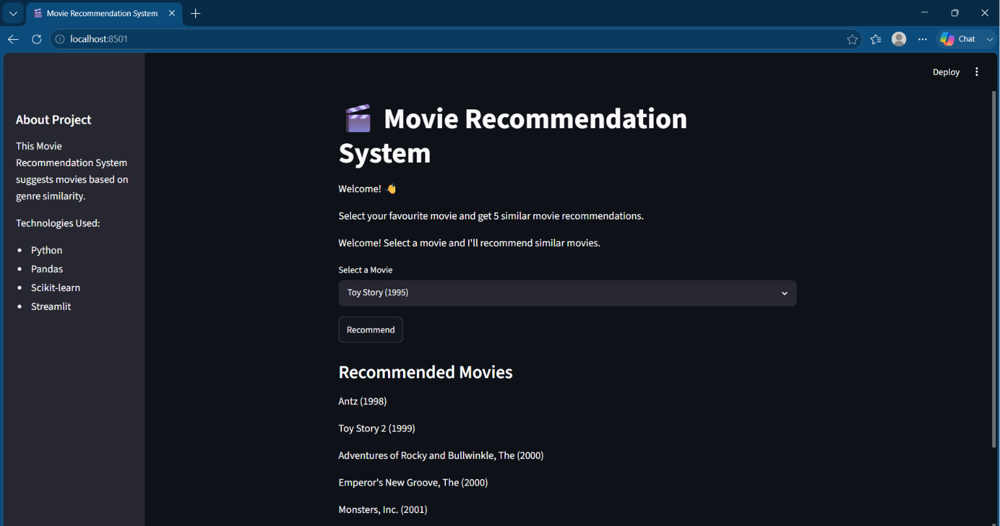

# 🎬 Movie Recommendation System



A simple Movie Recommendation System built using **Python**, **Pandas**, **Scikit-learn**, and **Streamlit**.
 The application recommends movies based on genre similarity using TF-IDF Vectorization and Cosine Similarity.

## 🚀 Live Demo

🔗 **Streamlit App:https://movie-recommendation-system-vo47i66ehiqpagkch2eftv.streamlit.app/
---

## 📌 Features

- Recommend 5 similar movies
- Interactive Streamlit web interface
- Genre-based recommendation system
- Fast recommendations using cosine similarity
- Beginner-friendly machine learning project

---

## 🛠 Technologies Used

- Python
- Pandas
- NumPy
- Scikit-learn
- Streamlit
- Pickle

---

## 📂 Project Structure

```
Movie-Recommendation-System/
│
├── dataset/
│   ├── movies.csv
│   └── ratings.csv
│
├── models/
│   ├── movies.pkl
│   └── similarity.pkl
│
├── app.py
├── train.py
├── requirements.txt
├── README.md
└── .gitignore
```

---

## 🚀 Installation

Clone the repository

```bash
git clone https://github.com/yourusername/Movie-Recommendation-System.git
```

Go into the project folder

```bash
cd Movie-Recommendation-System
```

Install dependencies

```bash
pip install -r requirements.txt
```

Run the application

```bash
streamlit run app.py
```

---

## 🧠 How It Works

1. Load the movie dataset.
2. Extract movie genres.
3. Convert genres into numerical vectors using TF-IDF.
4. Compute cosine similarity between all movies.
5. Recommend the top 5 most similar movies.

---

## 📸 Output

Select a movie from the dropdown menu and click **Recommend** to receive five similar movie recommendations.

---

## 📈 Future Improvements

- Add movie posters
- Search by actor or director
- Personalized recommendations
- Deploy online using Streamlit Community Cloud
- Improve UI with custom styling

---
---

## 📝 Note

The file `models/similarity.pkl` is not included in this repository because it exceeds GitHub's 100 MB file size limit.

To generate the required model files, run:

```bash
python train.py
```

This will recreate the similarity model required for the Movie Recommendation System.

## 👨‍💻 Author

**Gursheen Kaur Dhillon**
